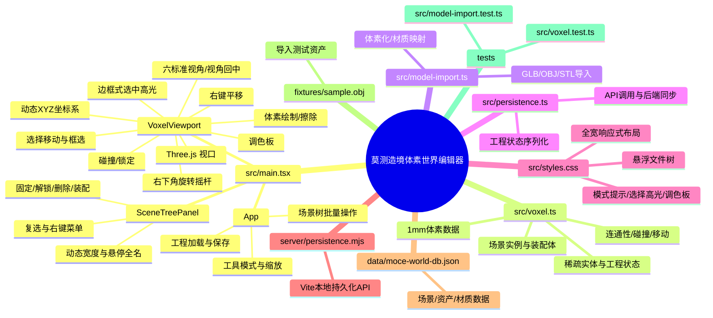

# 莫测造境体素世界编辑器项目结构

## 功能与代码映射



## 文件职责

- `src/main.tsx` 是前端交互编排入口，负责工具模式、场景树、视口手势、实体选择与批量操作。
- `src/voxel.ts` 保存体素、资产、实例、装配体和工程状态的核心模型，以及连通性、碰撞和移动相关逻辑。
- `src/model-import.ts` 负责 OBJ/STL/GLB 的导入、尺寸统一、体素化和材质映射。
- `src/persistence.ts` 负责工程状态序列化以及与本地持久化接口通信。
- `src/styles.css` 负责全宽自适应布局、悬浮文件树、选中高光、调色板和模式提示。
- `server/persistence.mjs` 是 Vite 开发服务器中的本地持久化中间件，数据写入 `data/moce-world-db.json`。
- `data/moce-world-db.json` 是当前内置场景、资产和材质数据；`fixtures/sample.obj` 用于导入测试。

## 运行与数据流

```text
浏览器
  → React / Three.js（src/main.tsx）
  → ProjectState（src/voxel.ts）
  → persistence.ts
  → Vite 本地 API（server/persistence.mjs）
  → data/moce-world-db.json
```

工程采用本地优先方式运行。前端状态是编辑过程中的事实来源，本地 JSON 是保存/重新打开后的持久化来源；`src`、`data` 和 `fixtures` 均纳入版本控制，`node_modules`、构建产物和 TypeScript 缓存不纳入版本控制。
